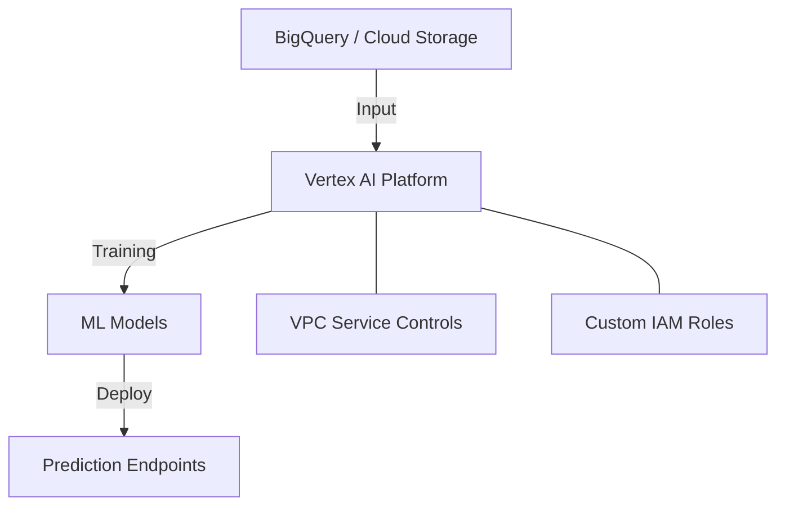

# AI (Vertex AI)
> **Architecture :** Plateforme unifiée de Machine Learning sur Google Cloud (Vertex AI), offrant des outils pour construire, déployer et mettre à l'échelle des modèles d'IA sécurisés. | **Version :** v2.3 | **Maintainer :** [Ravindra JOB](https://github.com/ravindrajob/)
---

## Hardening & Gouvernance
- **Vertex AI Workbench Sécurisé** : Déploiement de notebooks sans adresse IP publique et avec restriction de l'accès via Identity-Aware Proxy (IAP).
- **VPC Service Controls** : Inclusion des services Vertex AI dans un périmètre de sécurité pour prévenir l'exfiltration de données.
- **IAM Granulaire** : Utilisation de rôles personnalisés pour séparer l'accès aux datasets, aux entraînements et aux endpoints de prédiction.
- **Audit de Modèle** : Traçabilité complète des versions de modèles et des métadonnées d'entraînement via Vertex AI Metadata.
- **Standards** : Alignement avec les principes d'IA responsable de Google Cloud et les cadres de sécurité IA CNCF.

## Schéma Mermaid

## Conclusion
Adoption industrialisée du CAF avec surcouche de sécurité et intégration des pratiques CNCF.
