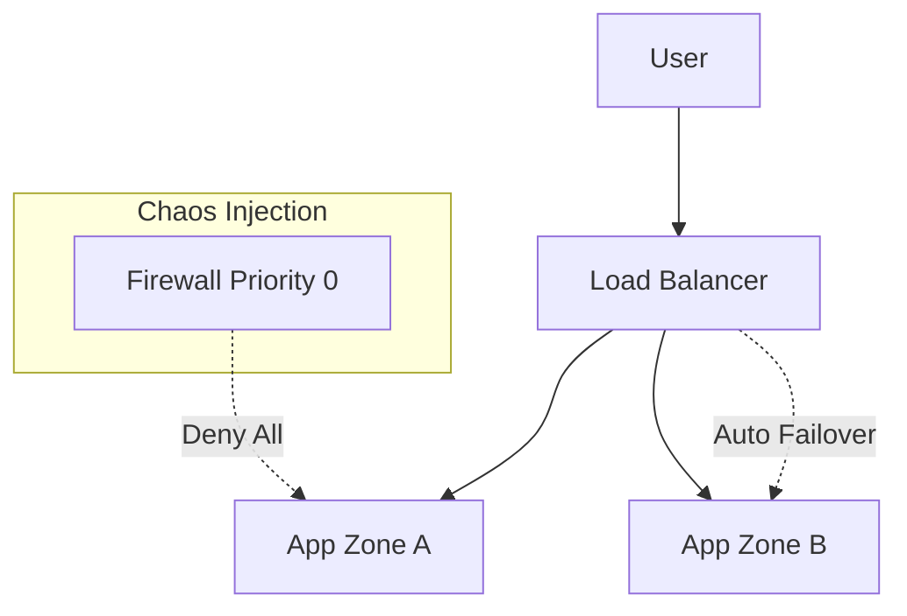

# ChaosEngineering (Firewall Blackout)
> **Architecture :** Simulation de panne réseau régionale via injection de règles de filtrage prioritaires | **Version :** v2.3 | **Maintainer :** [Ravindra JOB](https://github.com/ravindrajob/)
---

## Rôle du composant
Ce module permet d'injecter des pannes réseau contrôlées au sein de la Landing Zone. L'objectif est de valider les mécanismes de bascule (failover) et les politiques de reprise après sinistre (DRP).

## Hardening & Gouvernance
- **Test de Résilience (CNCF) :** Validation du comportement des microservices lors d'une isolation réseau totale (Blackout).
- **Audit de Détection :** Vérifie que la stack d'observabilité déportée alerte instantanément sur la rupture de flux.
- **Micro-segmentation :** Permet de tester l'étanchéité des règles de pare-feu hiérarchiques.

## Schéma Mermaid

## Conclusion
Adoption industrialisée du CAF avec surcouche de sécurité et intégration des pratiques CNCF.
