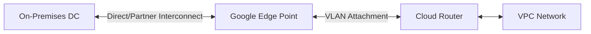

# Ravindra JOB - Cloud Architect
## Composant Landing Zone - Connectivity (Cloud Interconnect)
### Version: v1.2

## Rôle du composant
Solution de connectivité dédiée et à haut débit entre l'infrastructure on-premises et Google Cloud, offrant une disponibilité de niveau entreprise.

## Hardening & Gouvernance
- **VLAN Attachments Sécurisés** : Configuration de pièces jointes VLAN avec des capacités de bande passante dédiées et un routage BGP dynamique.
- **Chiffrement HA VPN over Interconnect** : Déploiement systématique de tunnels VPN IPsec sur la connexion Interconnect pour garantir le chiffrement des données.
- **Topologie Haute Disponibilité** : Architecture garantissant une disponibilité de 99.9% ou 99.99% via des circuits redondants sur plusieurs Edge Availability Domains.
- **Monitoring & Alerts** : Surveillance des métriques de circuit et d'état BGP via Cloud Monitoring avec alertes en temps réel.
- **Standards** : Conformité avec les architectures hybrides préconisées par le Google Cloud CAF.

## Schéma Mermaid

## Conclusion
Adoption industrialisée du CAF avec surcouche de sécurité et intégration des pratiques CNCF.
