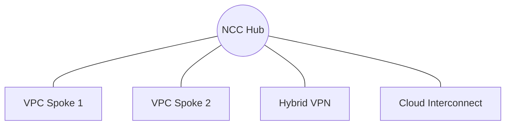

# Connectivity (NCC Hub)
> **Architecture :** Utilisation du Network Connectivity Center (NCC) comme hub centralisé pour simplifier la connectivité hybride et inter-VPC à grande échelle sur Google Cloud. | **Version :** v2.3 | **Maintainer :** [Ravindra JOB](https://github.com/ravindrajob/)
---

## Hardening & Gouvernance
- **Hub-and-Spoke Moderne** : Centralisation du routage via le NCC Hub pour une visibilité et un contrôle accrus sur l'ensemble du réseau global.
- **Spokes Redondants** : Configuration de spokes (VPC, VPN, Interconnect) hautement disponibles pour assurer une résilience maximale.
- **Isolation des Flux** : Utilisation de politiques de routage pour contrôler strictement les échanges entre les différents spokes connectés au hub.
- **Monitoring Centralisé** : Supervision de la topologie réseau et des performances de connectivité via le tableau de bord NCC.
- **Standards** : Alignement avec les architectures réseau avancées du Google Cloud CAF.

## Schéma Mermaid

## Conclusion
Adoption industrialisée du CAF avec surcouche de sécurité et intégration des pratiques CNCF.
