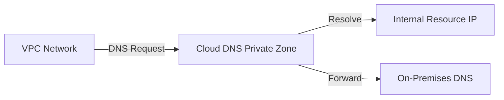

# DNS (Cloud DNS)
> **Architecture :** Gestion de la résolution de noms de domaine hautement disponible et sécurisée au sein de Google Cloud, supportant les zones privées et les architectures hybrides. | **Version :** v2.3 | **Maintainer :** [Ravindra JOB](https://github.com/ravindrajob/)
---

## Hardening & Gouvernance
- **Zones DNS Privées** : Création de zones visibles uniquement au sein des réseaux VPC sélectionnés pour éviter toute fuite d'informations réseau.
- **DNS Security (DNSSEC)** : Activation de DNSSEC pour protéger les zones DNS contre les attaques par empoisonnement de cache.
- **Politiques DNS de Serveur** : Configuration de politiques pour la résolution de noms vers des systèmes externes ou on-premises via des forwarders sécurisés.
- **Logging DNS** : Activation de Cloud Logging pour toutes les requêtes DNS afin d'assurer une traçabilité complète.
- **Standards** : Alignement avec les guides de conception réseau du Google Cloud CAF.

## Schéma Mermaid

## Conclusion
Adoption industrialisée du CAF avec surcouche de sécurité et intégration des pratiques CNCF.
