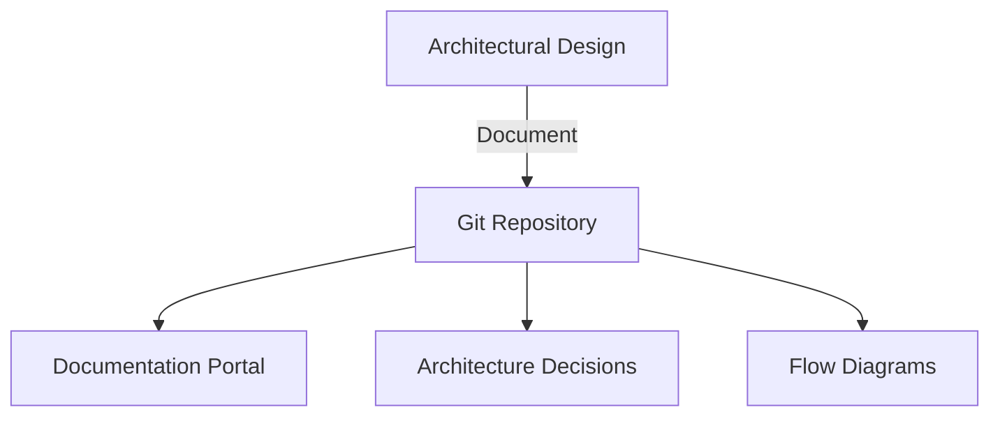

# Documentation (Architecture)
> **Architecture :** Centre de documentation centralisé hébergeant les spécifications techniques, les diagrammes de flux et les enregistrements de décisions d'architecture (ADR) pour Google Cloud. | **Version :** v2.3 | **Maintainer :** [Ravindra JOB](https://github.com/ravindrajob/)
---

## Hardening & Gouvernance
- **Versionnement Git** : Gestion de la documentation via Git pour assurer un historique complet et des processus de validation rigoureux.
- **Modèles de Conception** : Standardisation des documents pour garantir une clarté et une exploitabilité maximale par les équipes opérationnelles.
- **Revue de Sécurité** : Intégration des principes de sécurité dès la phase de documentation (Security by Design).
- **Diagrammes Dynamiques** : Utilisation de formats textuels (Mermaid) pour faciliter la mise à jour et la collaboration sur les schémas.
- **Standards** : Respect des cadres de documentation du CAF et des bonnes pratiques de l'industrie.

## Schéma Mermaid

## Conclusion
Adoption industrialisée du CAF avec surcouche de sécurité et intégration des pratiques CNCF.
