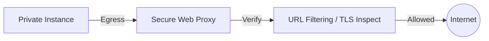

# EgressProxy (Secure Web Proxy)
> **Architecture :** Passerelle de sortie sécurisée (Secure Web Proxy) permettant de contrôler et d'inspecter le trafic web sortant des VPC vers Internet. | **Version :** v2.3 | **Maintainer :** [Ravindra JOB](https://github.com/ravindrajob/)
---

## Hardening & Gouvernance
- **Filtrage par URL/FQDN** : Restriction stricte de l'accès sortant à des destinations approuvées (Allow-list).
- **Inspection HTTPS** : Interception du trafic chiffré pour l'inspection de contenu et la détection d'exfiltration de données.
- **Identité de Source** : Politiques basées sur l'identité de l'appelant (Service Accounts) pour une granularité maximale.
- **Logs d'Audit Détaillés** : Journalisation de toutes les requêtes web, incluant l'URL complète, le code de réponse et l'identité de l'utilisateur.
- **Standards** : Conformité avec les architectures Zero Trust et les recommandations de sécurité périmétrique du CAF.

## Schéma Mermaid

## Conclusion
Adoption industrialisée du CAF avec surcouche de sécurité et intégration des pratiques CNCF.
