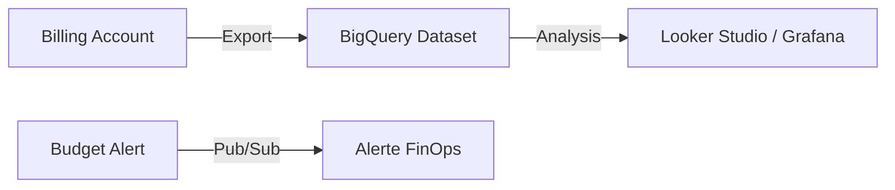

# FinOps (Billing Export & Quotas)
> **Architecture :** Industrialisation du suivi des coûts via BigQuery et alertes budgétaires | **Version :** v2.3 | **Maintainer :** [Ravindra JOB](https://github.com/ravindrajob/)
---

## Rôle du composant
Ce module assure la visibilité financière du datacenter Google Cloud. Il automatise l'export des données brutes de facturation pour une analyse fine (dashboarding) et définit les limites de consommation.

## Hardening & Gouvernance
- **Data Retention (Gouvernance) :** Stockage immuable dans BigQuery avec politique de partitionnement.
- **Alerting (FinOps) :** Seuils d'alertes configurés (50%, 90%, 100%) pour prévenir toute dérive budgétaire.
- **CAF Compliance :** Alignement sur le pilier "Financial Management" du CAF.

## Schéma Mermaid

## Conclusion
Adoption industrialisée du CAF avec surcouche de sécurité et intégration des pratiques CNCF.
