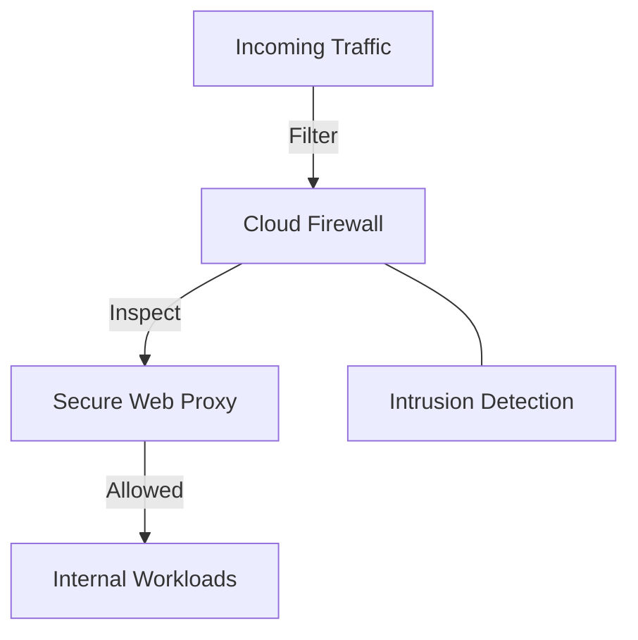

# Firewall (Cloud Firewall & SWP)
> **Architecture :** Système de protection réseau multicouche combinant les règles de pare-feu Cloud Firewall et le Secure Web Proxy (SWP) pour une inspection granulaire du trafic. | **Version :** v2.3 | **Maintainer :** [Ravindra JOB](https://github.com/ravindrajob/)
---

## Hardening & Gouvernance
- **Firewall Standard & Plus** : Utilisation des capacités avancées (FQDN filtering, intrusion prevention) pour une défense en profondeur.
- **Tags Réseau Sécurisés** : Application de règles basées sur des tags d'instance sécurisés (IAM-protected) plutôt que sur des adresses IP.
- **Inspection TLS** : Capacité de déchiffrer et d'inspecter le trafic chiffré pour identifier les menaces cachées.
- **Intégration Threat Intelligence** : Mise à jour automatique des règles basée sur les renseignements de menaces de Google (Cloud Armor & Mandiant).
- **Standards** : Alignement avec les préconisations de sécurité réseau du CAF et les standards CNCF.

## Schéma Mermaid

## Conclusion
Adoption industrialisée du CAF avec surcouche de sécurité et intégration des pratiques CNCF.
