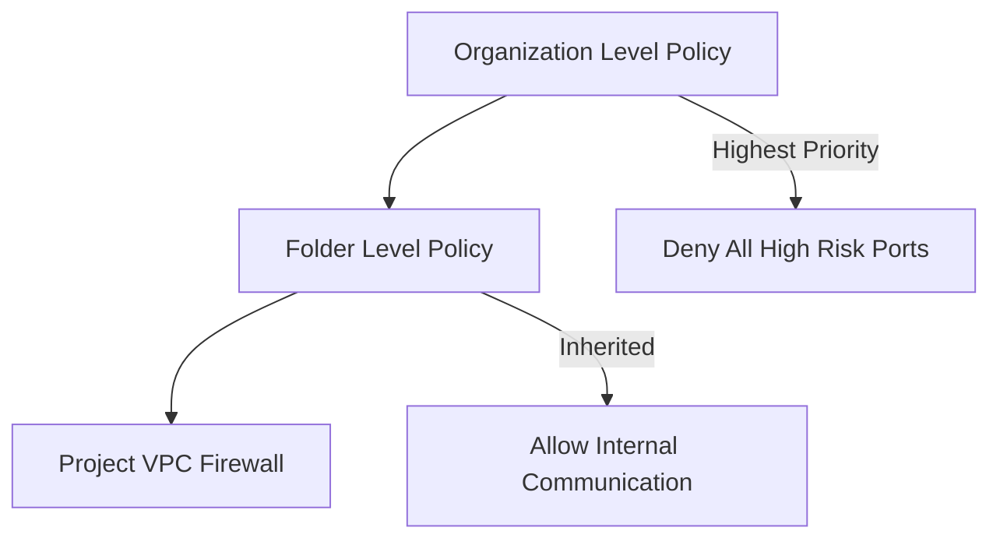

# Ravindra JOB - Cloud Architect
## Composant Landing Zone - Firewall (Hierarchical Policies)
### Version: v1.2

## Rôle du composant
Mise en œuvre de règles de pare-feu au niveau des dossiers ou de l'organisation pour garantir une sécurité cohérente à travers tous les projets GCP.

## Hardening & Gouvernance
- **Règles Globales (Guardrails)** : Application de règles de sécurité immuables qui prévalent sur les règles de pare-feu définies localement dans les VPC.
- **Standardisation de l'Inspection** : Forçage du trafic vers des appliances d'inspection centralisées via des politiques hiérarchiques.
- **Contrôle d'accès IAM** : Restriction de la modification des politiques hiérarchiques aux seuls administrateurs de sécurité de l'organisation.
- **Logging Centralisé** : Activation systématique du logging pour toutes les règles afin de faciliter l'audit et la conformité globale.
- **Standards** : Alignement avec le pilier "Security" du Google Cloud CAF et les pratiques de défense en profondeur CNCF.

## Schéma Mermaid

## Conclusion
Adoption industrialisée du CAF avec surcouche de sécurité et intégration des pratiques CNCF.
