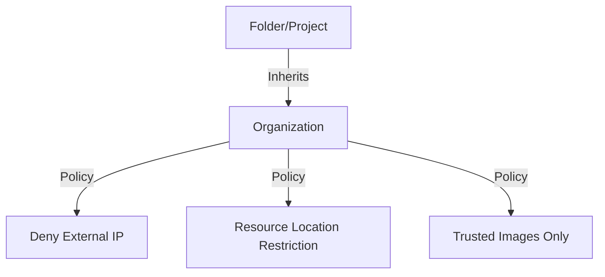

# Ravindra JOB - Cloud Architect
## Composant Landing Zone - Governance (Organization Policies)
### Version: v1.2

## Rôle du composant
Mise en œuvre des garde-fous globaux au niveau de l'organisation via les Organization Policies pour garantir une conformité et une sécurité immuables.

## Hardening & Gouvernance
- **Restrictions de Localisation** : Limitation du déploiement des ressources à des régions spécifiques autorisées.
- **Interdiction des IPs Publiques** : Désactivation forcée de la création d'adresses IP externes sur toutes les instances.
- **Contrôle de l'Usage des Services** : Restriction des APIs et services Google Cloud activables pour minimiser la surface d'attaque.
- **Gestion des Clés IAM** : Interdiction de la création de clés JSON de compte de service pour forcer l'usage de Workload Identity.
- **Standards** : Application stricte du pilier "Governance" du Google Cloud CAF et des benchmarks de conformité CIS.

## Schéma Mermaid

## Conclusion
Adoption industrialisée du CAF avec surcouche de sécurité et intégration des pratiques CNCF.
