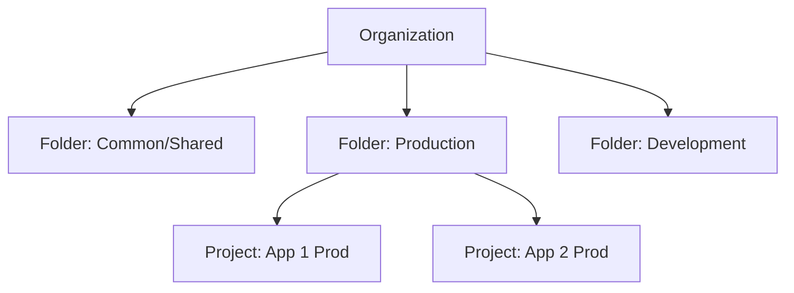

# Ravindra JOB - Cloud Architect
## Composant Landing Zone - Hierarchy (Folders & Projects)
### Version: v1.2

## Rôle du composant
Définition de la structure organisationnelle de Google Cloud via une hiérarchie de dossiers et de projets, permettant une gestion fine de l'héritage des politiques et de l'IAM.

## Hardening & Gouvernance
- **Structure par Environnement** : Organisation des dossiers par type d'environnement (Prod, Dev, Shared Services) pour une isolation stricte.
- **Héritage des Politiques** : Application de politiques d'organisation (Organization Policies) aux niveaux supérieurs pour garantir la conformité par défaut.
- **Quotas Centralisés** : Gestion des quotas de ressources au niveau des dossiers pour prévenir le sur-provisionnement accidentel.
- **Audit Logs** : Activation des Cloud Audit Logs au niveau de l'organisation pour tracer toutes les modifications administratives.
- **Standards** : Respect des meilleures pratiques du Google Cloud CAF pour la structuration de l'organisation.

## Schéma Mermaid

## Conclusion
Adoption industrialisée du CAF avec surcouche de sécurité et intégration des pratiques CNCF.
