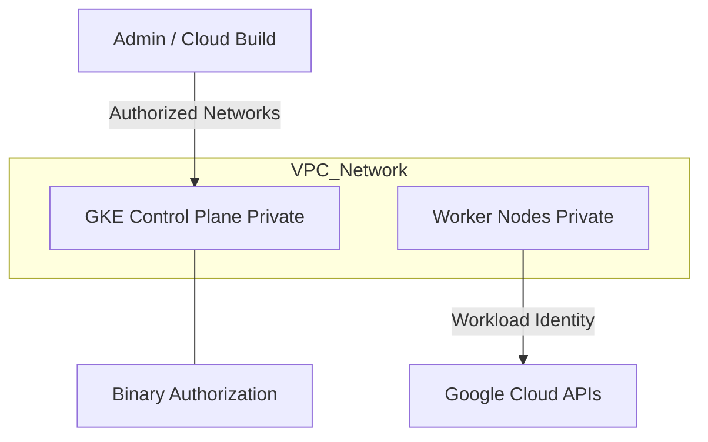

# Ravindra JOB - Cloud Architect
## Composant Landing Zone - Kubernetes (GKE Private)
### Version: v1.2

## Rôle du composant
Déploiement de clusters Google Kubernetes Engine (GKE) entièrement privés, où les nœuds et le plan de contrôle n'ont pas d'adresses IP publiques.

## Hardening & Gouvernance
- **Private Nodes & Master** : Isolation complète du réseau via des plages d'adresses IP privées (RFC 1918) et accès à l'API via des réseaux autorisés.
- **GKE Dataplane V2** : Utilisation du dataplane basé sur eBPF pour une sécurité et une visibilité réseau accrues.
- **Binary Authorization** : Mise en œuvre d'une politique de signature d'images pour garantir que seuls les conteneurs approuvés sont déployés.
- **Workload Identity** : Élimination de l'usage des clés JSON statiques pour les comptes de service Google en liant les identités K8s aux identités GCP.
- **Standards** : Alignement avec le GKE Hardening Guide, le Google Cloud CAF et les standards de sécurité CNCF.

## Schéma Mermaid

## Conclusion
Adoption industrialisée du CAF avec surcouche de sécurité et intégration des pratiques CNCF.
