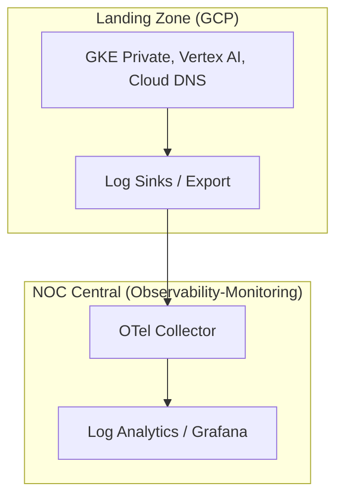

# Observability (Cloud Monitoring) > **Architecture :** Déport de l'observabilité et audit IA natif | **Version :** v2.3 | **Maintainer :** [Ravindra JOB](https://github.com/ravindrajob/)

## Rôle du composant
Le déport de l'observabilité est une pratique fondamentale du **SRE (Site Reliability Engineering)** visant à garantir que les signaux critiques (Golden Signals) sont collectés et stockés en dehors du périmètre de production immédiat. Cette approche permet d'éviter les **SPOF (Single Point of Failure)** : en cas de compromission ou de défaillance majeure de la Landing Zone, les traces d'audit et les métriques de performance restent accessibles et intègres dans le socle de sécurité centralisé.

## Hardening & Gouvernance
La configuration applique des contrôles de sécurité rigoureux conformes aux standards industriels :
- **Audit DNS Deep Logging :** Capture exhaustive de toutes les résolutions DNS pour détecter les exfiltrations de données et les communications C2 (Command & Control).
- **Audit IA A2A (Vertex AI) :** Surveillance active des interactions avec les modèles de fondation pour valider le respect du protocole **Action-to-Action**, garantissant l'intégrité des agents autonomes.
- **VPC Flow Logs :** Journalisation granulaire des flux réseau pour l'audit de conformité et la détection d'anomalies de trafic.
- **Log Sinks & Diagnostic Settings :** Exportation automatisée et sécurisée des logs d'audit vers des buckets immuables et le NOC Central via des puits de journaux (Log Sinks) hautement disponibles.

## Schéma Mermaid

## Conclusion
Adoption industrialisée du CAF avec surcouche de sécurité et intégration des pratiques CNCF.
