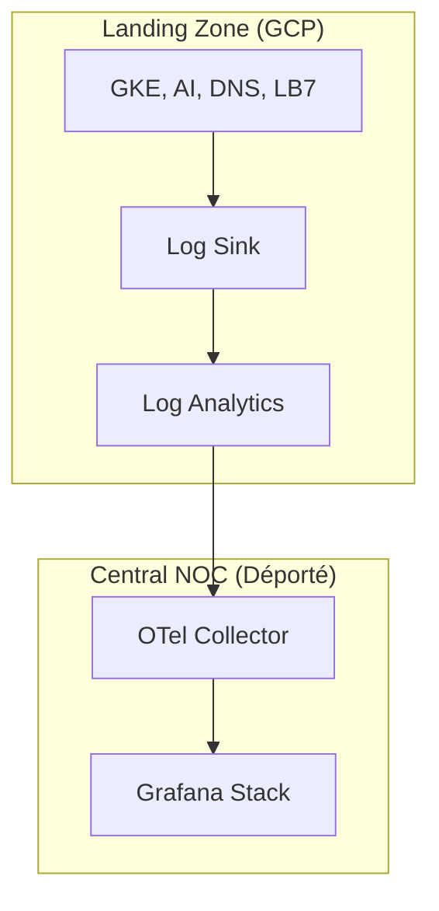

################################################################
# Titre: Observability (Cloud Monitoring) - README
# Description : Pourquoi déporter l'observabilité et auditer l'IA
# Auteur: Ravindra JOB
# Source: https://github.com/ravindrajob/
# Update: 22/05/2026 [v1.2 | RJ]
################################################################

# Observability (GCP Cloud Monitoring)

💡 **Rôle du composant :** 
Fournir une visibilité complète sur l'état de santé et la sécurité de la Landing Zone, avec une concentration particulière sur les flux d'IA et les requêtes DNS.

## Pourquoi ce choix technique ?
Conformément aux principes **SRE**, l'observabilité est déportée pour éviter les SPOF. Nous utilisons un **Log Analytics Workspace** natif pour traiter les gros volumes de données localement avant d'exporter les métriques critiques vers notre SOC central.

## Hardening & Gouvernance (CAF & CNCF)
- **AI Audit (A2A Compliance) :** Activation systématique de l'audit des requêtes Vertex AI. Indispensable pour valider que les agents respectent le protocole **Action-to-Action**.
- **DNS Deep Logging :** Chaque résolution de nom est logguée pour détecter les comportements suspects (exfiltration via DNS).
- **Log Immutability :** Les logs d'audit sont verrouillés dans un bucket spécifique avec une rétention imposable par politique.

---
*Adoption industrialisée du CAF avec surcouche de sécurité et intégration des pratiques CNCF.*
