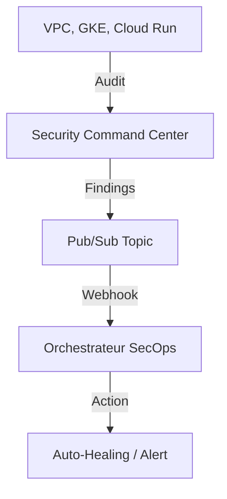

# SecOps (Security Command Center)
> **Architecture :** Plateforme de détection des menaces et conformité de sécurité centralisée | **Version :** v2.3 | **Maintainer :** [Ravindra JOB](https://github.com/ravindrajob/)
---

## Rôle du composant
Le SOC Cloud natif de la Landing Zone. Il détecte les vulnérabilités de configuration (ex: buckets publics), les menaces (ex: cryptomining) et les violations de politiques en temps réel.

## Hardening & Gouvernance
- **Threat Detection (Security) :** Monitoring continu du Control Plane et des logs d'audit.
- **Auto-Remediation (SecOps) :** Export des findings vers Pub/Sub pour déclencher des fonctions de correction automatique (Self-healing).
- **CNCF Standards :** Alignement sur les frameworks de détection et de réponse aux incidents Cloud Native.

## Schéma Mermaid

## Conclusion
Adoption industrialisée du CAF avec surcouche de sécurité et intégration des pratiques CNCF.
