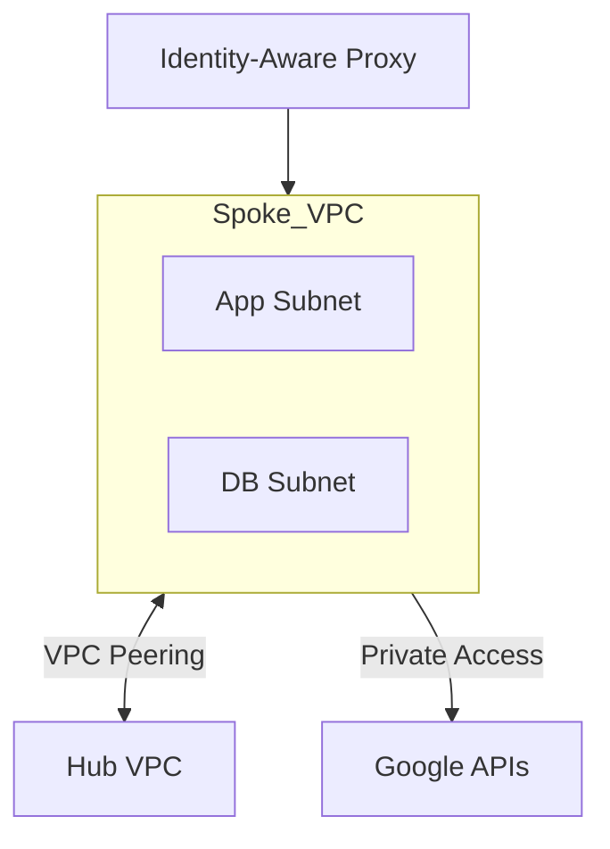

# Workloads (VPC Spokes)
> **Architecture :** Provisionnement standardisé de réseaux VPC "Spoke" pour l'hébergement des applications, isolés par défaut et connectés au VPC Hub via le peering VPC ou Network Connectivity Center. | **Version :** v2.3 | **Maintainer :** [Ravindra JOB](https://github.com/ravindrajob/)
---

## Hardening & Gouvernance
- **Pas d'Adresses IP Publiques** : Utilisation exclusive de Cloud NAT pour le trafic sortant et interdiction des IPs publiques sur les instances via Organization Policy.
- **VPC Flow Logs** : Activation systématique avec un taux d'échantillonnage ajusté pour une visibilité totale sur les flux réseau.
- **Private Google Access** : Activation pour permettre aux instances sans IP publique de consommer les APIs et services Google Cloud.
- **Accès via IAP** : Utilisation de Identity-Aware Proxy (IAP) pour l'accès administratif (SSH/RDP) sécurisé sans bastion.
- **Standards** : Alignement avec les blueprints de segmentation du Google Cloud CAF et les architectures multi-tenant CNCF.

## Schéma Mermaid

## Conclusion
Adoption industrialisée du CAF avec surcouche de sécurité et intégration des pratiques CNCF.
